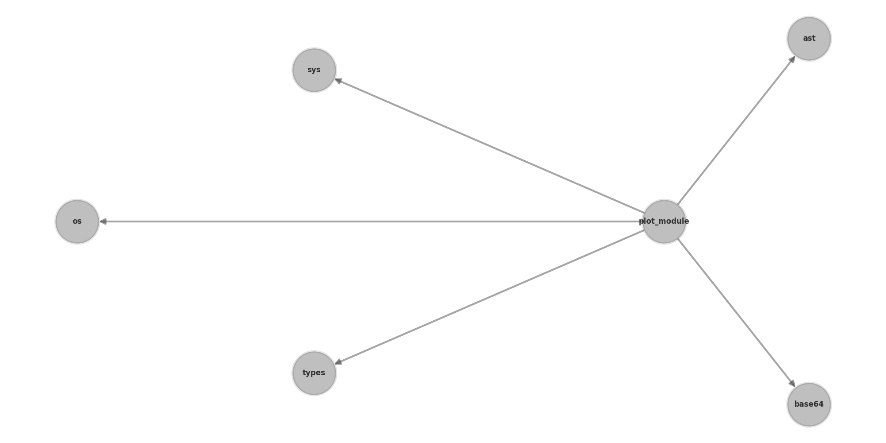
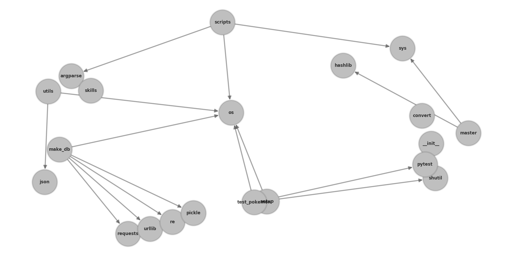

# Python Module Grapher

Fun script for plotting the internal and external dependency structure of python modules. This was made for fun; there are much better tools out there for plotting dependencies, like:

- [pydeps by thebjorn](https://github.com/thebjorn/pydeps)
- [py3-dependency-graph](https://pypi.org/project/py3-dependency-graph/)

^ You should use those. Also, check out [Kevin Gullikson](http://kgullikson88.github.io/blog/)'s [visualization](https://kgullikson88.github.io/blog/pypi-analysis.html) of the dependency structure of pypi for the pinnacle of dependency visualizations

## Usage

Plotting a local repository:

```python
graph = get_repo('path/to/repo')
plot_dependencies(graph, 'image_of_graph.png', style = 'kamada_kawai')
```

Plotting a repository from github:

```python
graph = get_repo('mwetzel7r/python-module-grapher', from_github = True)
plot_dependencies(graph, 'image_of_graph.png', style = 'kamada_kawai')
```

- the pygithub API might get mad at you for making too many calls (you can get around that by providing authentication during the API call)
  - unless you're going overboard you should be fine

## Examples

Here's a plot of this repo:



Here's an example of [vsoch](https://github.com/vsoch) (a very cool researcher at Standford)'s [pokemon](https://github.com/vsoch/pokemon) repo:



It works best for smaller repos; it sort of gets unwieldy (but also kind of funny) when plotting large repos, like [numpy](https://github.com/numpy/numpy):


## How it works

- first, all of the python files in a repository are added to the `graph` dictionary
- then, all files in the `graph` dictionary are scanned with python's `ast` library, to find out what modules they're importing
- then, the `graph` is converted to a [networkx](https://networkx.github.io/) object, which handles all the plotting

## Dependencies

- [matplotlib](https://matplotlib.org/) for plotting
- [networkx](https://networkx.github.io/) for plotting/interacting with graphs
- [PyGithub](https://github.com/PyGithub/PyGithub) for scraping github repos

## Limitations

- only works with python (relies on the python AST module)
- arranging all the nodes is a challenge and isn't always interpretable
- doesn't really handle variables and functions very well, so i just opted out of trying to plot them
- for large repos, there will probably be missing modules / mistakes it makes ¯\\_(ツ)\_/¯

## Roadmap

- color nodes based on whether they're internal, external, or from the python standard lib
- plot variables/functions that are shared across scripts (im finding this to be sort of difficult)
- finding a way to organize nodes based on whether they all fall in the same directory
- convert to html/javascript and add to personal website 🤙